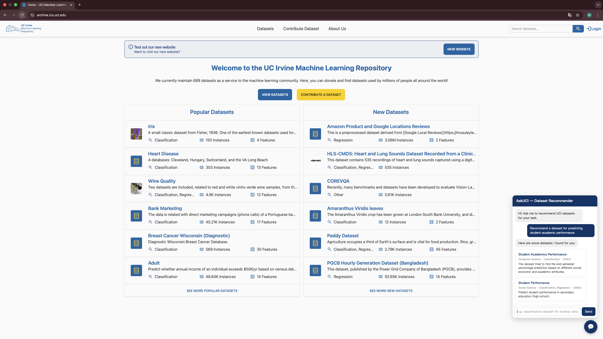
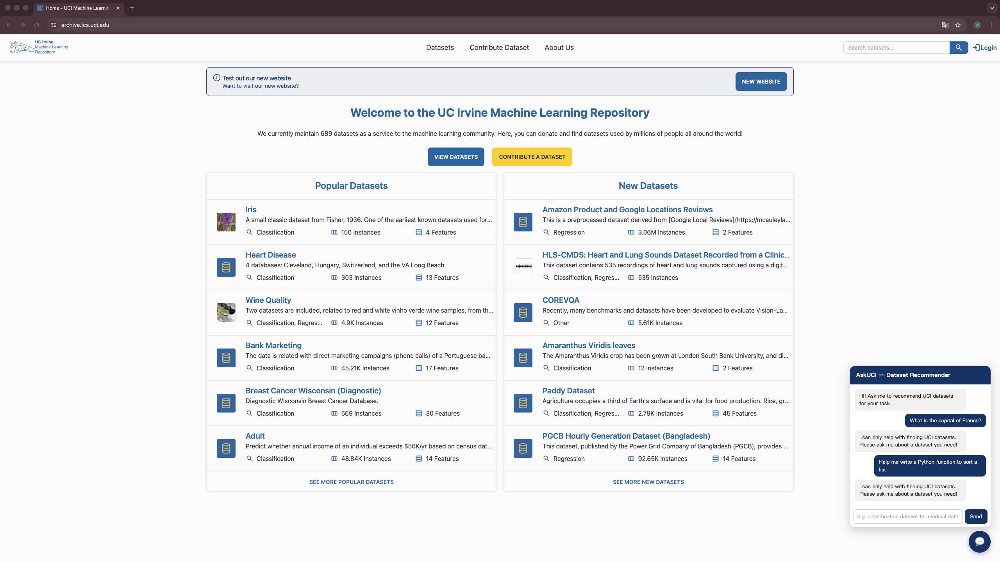

# AskUCI

Finding the right dataset used to mean clicking through filters, scanning abstracts, and repeating until something stuck. Not painful, just slow. AskUCI lets you describe what you're looking for in plain English and returns the most relevant datasets from the [UCI Machine Learning Repository](https://archive.ics.uci.edu/) instantly.

The core idea is simple: embed all 689 dataset descriptions into a vector space, then retrieve the closest matches to your query. No LLM needed for the retrieval itself, the semantic similarity does the work.

## Design Decisions

**Why `all-MiniLM-L6-v2` instead of OpenAI embeddings?**

It runs locally, costs nothing, and is fast enough to embed all 689 datasets in under a minute. For short descriptive text like dataset abstracts, the quality difference vs. a hosted embedding model is negligible. Keeping embedding local also means the vector DB can be rebuilt without any API dependency.

**Why return 5 results?**

Enough to surface variety without overwhelming the user. In practice, the top 1–2 results are almost always relevant; results 3–5 provide useful alternatives when the query is ambiguous. Going beyond 5 added noise without improving usefulness in informal testing.

**Why a guard layer?**

Without it, the retriever returns results for any query — ask "tell me a joke" and you'll get a list of datasets about humor or language. The guard (`gpt-4o-mini`) checks intent before hitting the vector DB and returns a refusal message for off-topic queries. Using `gpt-4o-mini` keeps cost low since it only classifies intent, not generates content.

## Demo

*Dataset Recommendation*

*Guard (Off-topic Query)*

## Reflections & Next Steps

The retrieval-only approach works surprisingly well here, dataset descriptions are short and consistent enough that embedding similarity alone is a strong signal. A few things stood out during testing: domain-specific queries ("time series", "imbalanced classification") retrieve noticeably more precise results than vague ones. The guard handles clear off-topic queries well but occasionally misclassifies broad questions ("what datasets exist?") as off-topic. And rebuilding the full vector DB takes ~45 seconds on CPU, which would become a bottleneck at larger scale.

If I were to continue:
- **From retrieval to training** — AskUCI relies entirely on pretrained embeddings. A natural evolution would be training a domain-specific model that learns from user queries and click-through signals, similar to the approach explored in [movierec-two-towers](https://github.com/ShengPeiWilliam/movierec-two-towers).
- **Reranking** — use a cross-encoder to score top-k results against the query, which would help with queries that match on surface keywords but not actual intent.
- **Attribute filtering** — let users narrow by dataset size, feature types, or task type before or after retrieval.
- **Accessibility** — package as a browser extension or lightweight web app.

## References

- [UCI ML Repository](https://archive.ics.uci.edu/) — dataset source, 689 datasets scraped for embedding.
- [all-MiniLM-L6-v2](https://huggingface.co/sentence-transformers/all-MiniLM-L6-v2) — embedding model chosen for local inference and zero API cost.
- [Chroma](https://www.trychroma.com/) — vector store for semantic retrieval.
- [LangChain](https://python.langchain.com/) — orchestration layer for the RAG chain.
